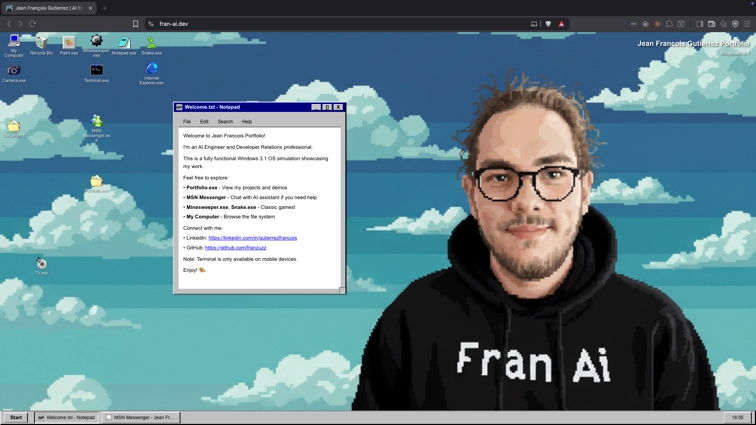
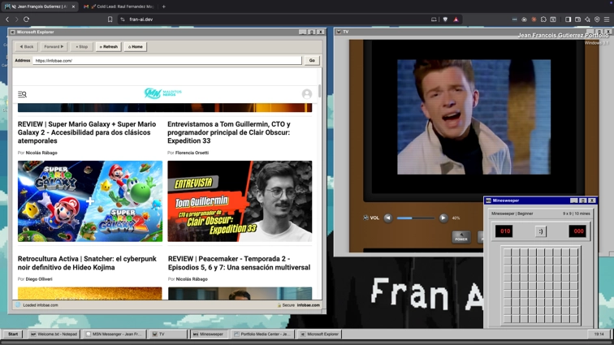
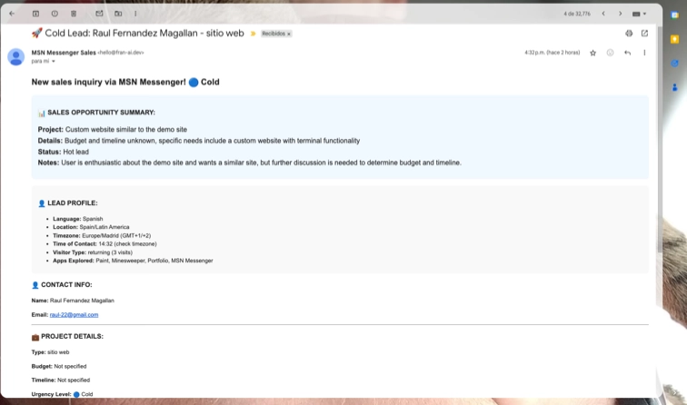

# 🖥️ Windows 3.1 Portfolio – AI-Powered Time Machine

*What if Windows 3.1 had AI agents?*



**Live Demo**: [fran-ai.dev](https://fran-ai.dev) · **Star if it blew your mind** ⭐ · **Clone the OS**: [`DrZuzzjen/personal-site`](https://github.com/DrZuzzjen/personal-site)

A fully functional Windows 3.1 operating system simulation with:
- 🤖 **Multi-agent AI system** that routes leads, qualifies prospects, and controls the desktop
- 🎨 **Pixel-perfect Paint.exe** with real canvas drawing and export
- 💣 **Classic Minesweeper** built from scratch with authentic logic
- 📁 **Complete file system** with Windows-style navigation and persistence
- 🪟 **True window manager** (drag, minimize, z-index stacking, outline drag)
- 🧠 **Automations & easter eggs** intentionally hidden across the OS

This isn't a theme. It's a technical flex disguised as nostalgia.

## 📑 Table of Contents
- [🏆 Recognition](#-recognition)
- [🤯 Wait, What Did You Just Build?](#-wait-what-did-you-just-build)
- [🚀 Try It Now (30 seconds)](#-try-it-now-30-seconds)
- [🧭 Guided Tour](#-guided-tour)
- [🧠 Multi-Agent Brain](#-multi-agent-brain)
- [💼 AI Sales Pipeline](#-ai-sales-pipeline)
- [🧱 Architecture Highlights](#-architecture-highlights)
- [🛠️ Tech Stack & Tooling](#-tech-stack--tooling)
- [🔒 Quality & Observability](#-quality--observability)
- [🔮 Roadmap](#-roadmap)
- [🤝 Contributing](#-contributing)
- [👨‍💻 About Jean François](#-about-jean-françois)
- [⭐ Star History](#-star-history)
- [📄 License](#-license)

## 🏆 Recognition
[](https://github.com/DrZuzzjen/personal-site/stargazers)
[](https://fran-ai.dev)
[](./)
[](./)
[](./)
[](#-license)

> "*This is the most creative portfolio I've ever seen.*" – Random Developer  
> "*I spent 20 minutes playing Minesweeper instead of reading your CV.*" – Recruiter

## 🤯 Wait, What Did You Just Build?
This is a **complete operating system simulation** running inside the browser, orchestrated by modern AI infrastructure.

### 🤖 Multi-agent Control Center
- **Router Agent** understands intent (sales vs casual vs system commands).
- **Sales Agent** qualifies leads, captures structured data, and can send automated follow-ups.
- **Field Extractor** parses PII with confidence scoring for CRM-ready data.
- **Desktop Agent** accepts natural language commands like "open MS Paint" or "close Minesweeper."




### 🏗️ Engineered Like an OS
- Custom **window manager**: outline dragging, z-index orchestration, taskbar integration.
- Persistent **file system**: create/fork files, system-level protections, localStorage sync.
- Dedicated **apps suite**: Notepad, Paint, Minesweeper, TV, Camera, hidden modules.
- Authentic **boot sequence**: POST screen, memory check, skip logic for returning users.
- Delightful **UX polish**: copy-protected files, novelty dialogs, timed animations.

## 🚀 Try It Now (30 seconds)
**Option 1: Live Demo**  
👉 [fran-ai.dev](https://fran-ai.dev) – boot into Windows 3.1 instantly.

**Option 2: Run Locally**
```bash
git clone https://github.com/DrZuzzjen/personal-site.git
cd personal-site
npm install
npm run dev
# Visit http://localhost:3000 and enjoy the boot sequence
```

### What to try first?
1. Press `Alt + Space` inside any window to see hidden shortcuts.  
2. Ask the AI assistant to "open my resume" or "launch Minesweeper."  
3. Paint a masterpiece, export as PNG, and drop it into the file explorer.  
4. Trigger the easter eggs by poking around the Windows folder. 😉

## 🧭 Guided Tour
- **Boot & Desktop**: Authentic POST screen, typewriter intro, draggable icons.
- **Start Menu**: Programs, Documents, Settings, Restart, Shut Down – all functional.
- **File Explorer**: Navigate real folder hierarchy, open About.txt, find your CV on the floppy drive.
- **Apps**: Minesweeper, Paint, Notepad, TV, Camera, plus hidden surprises.
- **Taskbar**: Live window buttons, system clock, minimized windows, right-click context menus.
- **AI Concierge**: Open the assistant and ask it to orchestrate the system for you.

## 🧠 Multi-Agent Brain
- **Intent Router** – Zod-validated classification routes requests to the right specialist.
- **Sales Agent** – Multi-step prompt chain that gathers name, company, use case, urgency.
- **Field Extractor** – Runs PII/entity extraction with confidence scoring for CRM export.
- **Desktop Operator** – Bridges natural language to deterministic window/file actions.
- **Safety Layer** – Guardrails prevent destructive commands while preserving playful chaos.

## 💼 AI Sales Pipeline
- **Agentic Handoff** – Router Agent blends LLM reasoning with deterministic rules to classify inbound chats into sales-qualified, casual, or system ops, then forwards context-rich briefs to the Sales Agent.
- **Progressive Discovery** – Sales Agent runs a scripted-but-flexible interview: captures role, company, primary pain, timeline, and budget signals while mirroring tone to stay human.
- **Field Extraction** – Extractor Agent normalizes names, emails, companies, and intents into a CRM-ready schema with confidence scoring and fallback prompts when data is ambiguous.
- **Opportunity Scoring** – Sales flow attaches a lightweight score surfaced in the UI and exported with the conversation so high-value leads can be fast-tracked.
- **Auto Follow-up Email** – As soon as a lead qualifies, the system composes a tailored email recap (resumen) that includes the prospect’s goals, recommended next step, and optional resume link.
- **Attached Assets** – Follow-ups can automatically pull in the Windows 3.1 `Resume.pdf`, proposal templates, or Calendly CTAs so the lead has everything needed to move forward.
- **Inbox Ready Output** – Follow-up is rendered in HTML + plaintext for direct paste into Gmail/Outlook or to be sent via the Resend integration.
- **Audit Trail** – Conversation log, extracted fields, score, and composed email are bundled into a single payload that can be piped into CRMs or shared across the agent mesh.



## 🧱 Architecture Highlights
- **Window System** – Declarative registry with focus management, outline dragging, resize handles, snapping.
- **File System** – Tree-based data model with CRUD, system file locks, and localStorage persistence.
- **Canvas & Games** – HTML5 Canvas paint engine, Minesweeper flood-fill algorithm, instant win/lose detection.
- **State Management** – Context-driven architecture (`WindowContext`, `FileSystemContext`) with custom hooks.
- **Performance** – Lazy app loading, memoized selectors, snail-proof event handling for drag operations.
- **DX Tooling** – Type-safe registries, shared constants, linting & Vitest coverage for confidence.

## 🛠️ Tech Stack & Tooling
- **Framework**: Next.js 15 (App Router, React 19)  
- **Language**: TypeScript end-to-end (0 `any` in production code)  
- **Styling**: Tailwind CSS v4 + handcrafted pixel borders  
- **AI**: Vercel AI SDK, Groq for low-latency inference, custom agent pipelines  
- **Persistence**: Browser localStorage, deterministic default state  
- **Deployment**: Vercel (edge caching, analytics), fully static-friendly build  
- **Tooling**: ESLint 9, Vitest 3, Turbopack dev server, TSX scripts for DX utilities

## 🔒 Quality & Observability
- Automated linting and type checks gate every deployment.  
- Vitest suites cover file system logic, game rules, and window manager reducers.  
- Error boundary instrumentation surfaces broken windows without crashing the OS.  
- Custom analytics events track app launches, agent conversations, and easter egg triggers.

## 🤝 Contributing
1. 🍴 Fork the repository  
2. 🌿 Create a feature branch (`git checkout -b feat/amazing-feature`)  
3. 💻 Implement your enhancement (screenshots welcome!)  
4. ✅ `npm run lint` & `npm test` to keep the OS stable  
5. 📤 Submit a PR describing the feature + demo steps

Looking for: retro game ports, accessibility upgrades, new agent skills, and OG Windows easter eggs.

## 👨‍💻 About Jean François
**AI Engineer & Developer Relations** helping companies integrate AI into production workflows.

- 🏢 DevRel at Kluster.ai (AI-powered code verification tooling)  
- 🤖 Delivered $20M+ cost savings via automation initiatives  
- 🏆 Patent holder in AI safety for software development  
- 🎙️ Speaker, workshop host, AI strategy advisor  
- 🎯 Expert in Gen AI, RAG, LangChain, LlamaIndex, MCP integrations

**Connect**  
💼 [LinkedIn](https://linkedin.com/in/jeanfrancoisgutierrez) · 🐙 [GitHub](https://github.com/franzuzz) · 🌐 [fran-ai.dev](https://fran-ai.dev) 

**Why Windows 3.1?**  
> "I wanted people to say *Wait, WHAT?!* Nostalgia plus cutting-edge AI proves we can blend playful experiences with serious engineering."

## ⭐ Star History
[](https://star-history.com/#DrZuzzjen/personal-site&Date)

## 📄 License
MIT License – remix, fork, and build your own retro-OS portfolio.
